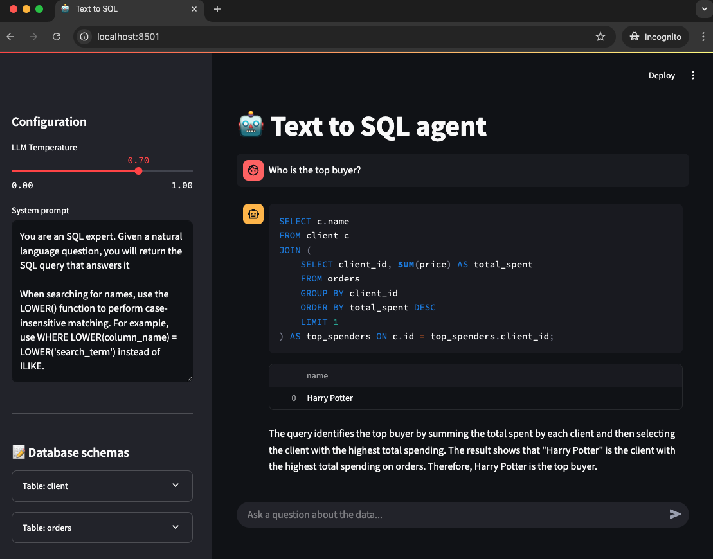
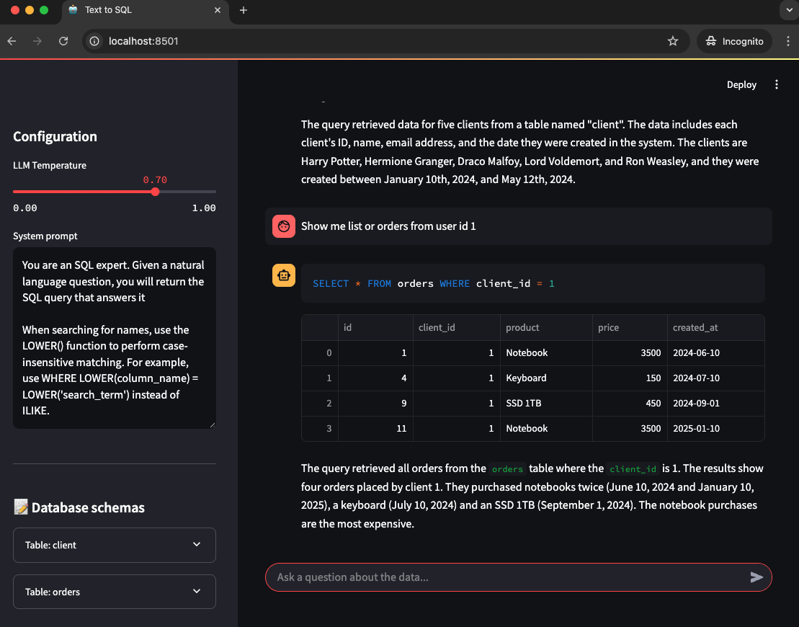

# 🤖 Text to SQL Agent





This small POC application is a Text-to-SQL agent that allows you to query a sample SQLite database using natural language. It leverages the power of the LLM models to translate your questions into SQL queries, execute them, and provide you with the results and a human-readable explanation.

## ✨ Features

- **Natural Language to SQL:** Ask questions about your data in plain English.
- **Google Gemini Integration:** Utilizes the Gemini language model for intelligent SQL query generation and result explanation.
- **SQLite Database:** Includes an in-memory SQLite database with sample `client` and `orders` tables.
- **Database Schema Exploration:** Easily view the schema of the tables in the sidebar.
- **Interactive UI:** Built with Streamlit for a user-friendly experience.
- **Dynamic Configuration:** Adjust the Gemini model's temperature and the system prompt directly from the sidebar.

## 🚀 Getting Started

### Prerequisites

- Python 3.10+
- pip (Python package installer)
- A Google Cloud project with the Gemini API enabled and an API key.

### Installation

1.  **Install the required Python packages:**

    ```bash
    pip install -r requirements.txt
    ```

2.  **Create a `.env` file** in the same directory as your `app.py` and add your Google Gemini API key:

    ```
    GOOGLE_API_KEY="YOUR_GOOGLE_API_KEY"
    ```

    **Replace `"YOUR_GOOGLE_API_KEY"` with your actual API key.**

### Running the Application

1.  **Ensure you are in the project directory in your terminal.**
2.  **Run the Streamlit application:**

    ```bash
    streamlit run app.py
    ```

3.  **The application will open in your web browser.** You can now start asking questions about the sample data in the input field.

## ⚙️ Configuration

The sidebar provides the following configuration options:

- **LLM Temperature:** Controls the randomness of the Gemini model's output. Lower values (e.g., 0.2) make the output more deterministic, while higher values (e.g., 0.9) make it more creative.
- **System prompt:** Defines the instructions given to the Gemini model, influencing how it generates SQL queries. You can modify this to adjust the agent's behavior.
- **Database schemas:** An expandable section that displays the schema (table names and column definitions) of the `client` and `orders` tables.

## 💡 How to Use

1.  **Explore the database schema** in the sidebar to understand the available tables and columns.
2.  **Enter your natural language question** in the "Ask a question about the data..." input field at the bottom of the application.
3.  **The agent will:**
    - Display the generated SQL query.
    - Execute the query against the sample database.
    - Show the results in a table.
    - Provide a human-readable explanation of the results.

## 🛠️ Built With

- [Streamlit](https://streamlit.io/): For creating the interactive web application.
- [pandas](https://pandas.pydata.org/): For handling and displaying tabular data.
- [sqlite3](https://docs.python.org/3/library/sqlite3.html): For the in-memory SQLite database.
- [google-generativeai](https://ai.google.dev/docs/reference/rest): The official Python library for the Google Gemini API.
- [python-dotenv](https://pypi.org/project/python-dotenv/): For loading environment variables from a `.env` file.

## ⚖️ Copyright and Disclaimer

Please note that the sample data in the `client` table includes names of characters from the Harry Potter series. These names and the Harry Potter universe are copyright of Warner Bros. Entertainment Inc. and J.K. Rowling. This project uses these names solely for demonstration purposes and does not claim any ownership or affiliation with the Harry Potter franchise.

The code in this project is open-source and available under the [MIT License](LICENSE).

## 🙏 Acknowledgements

- This is a simple POC inspired by [Text 2 Sql](https://www.text2sql.ai/).
- It only query the database, it will not create, update or delete rows.
- Feel free to add more features.